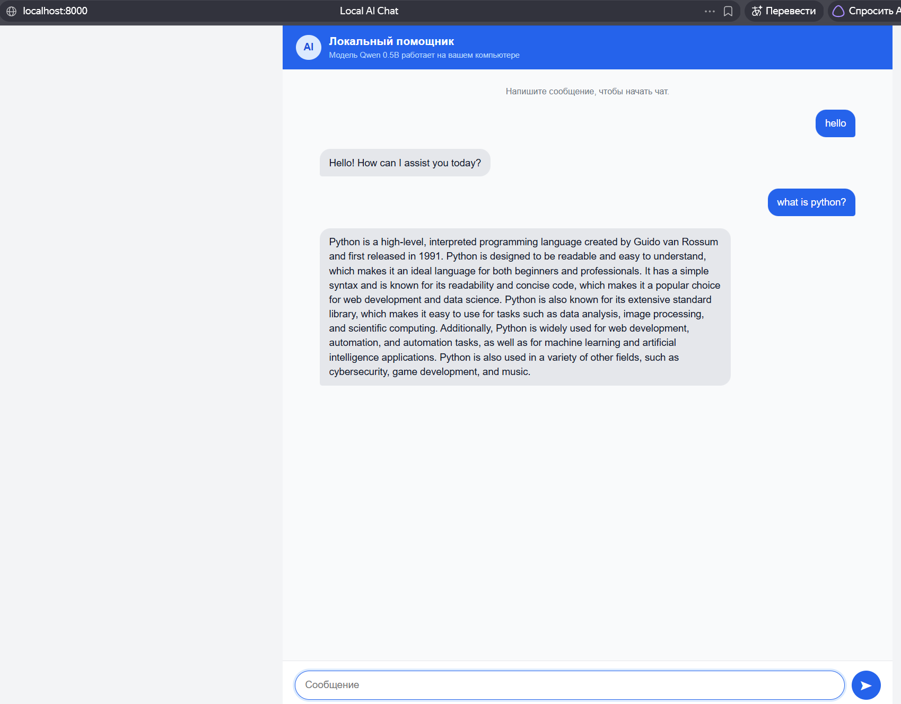

# Local AI Chat

Локальный чат с моделью `qwen2.5:0.5b` через Ollama.

## Запуск

```bash
cd web
docker compose up -d --build
```


```bash
docker compose exec ollama ollama pull qwen2.5:0.5b
```

Откройте http://localhost:8000.

Первый запуск скачивает модель примерно на 400 MB. Все последующие запросы выполняются локально, API-ключ и интернет для чата не нужны.

## Компоненты

- `web` - FastAPI и web-интерфейс
- `ollama` - локальный inference-сервер
- `qwen2.5:0.5b` - небольшая instruct-модель, выбранная для примера

